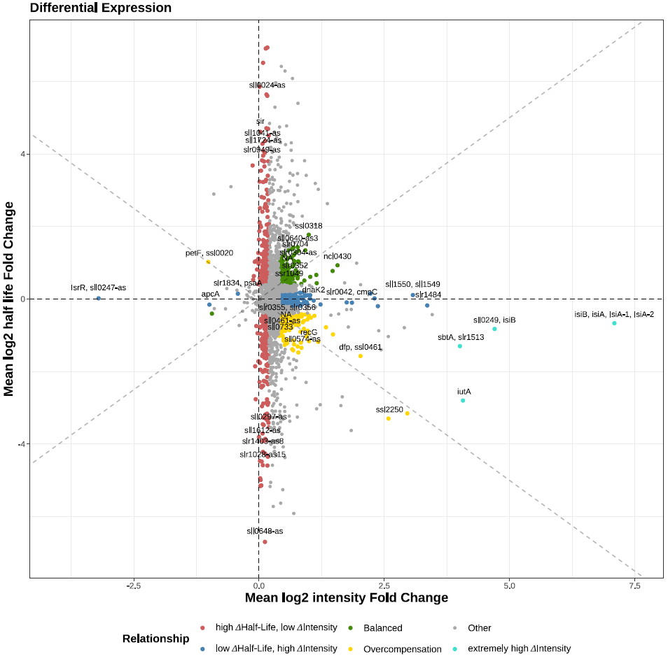

# Vertiefungspraktikum Hess

This repository contains R scripts and workflows from my internship project at the Hess Lab.

## 📦 Project Description

This project involves the analysis of gene expression by segmentation of Mircroarray or RNA-seq data using Rcpp and other tools.
The code processes experimental data, performs segmentation using Rcpp, and visualizes the results using ggplot2.

## 🔁 Example Workflow
To begin, the data must be loaded into R. This can be done in one of two ways:

   - If you already have processed data, load it directly as a SummarizedExperiment object.

   - If starting from raw data, use the prepare_replicate_data_for_fit.R pipeline to process it into the correct format.

📥 Loading and Preparing the Normalized Microarray Data

This section reads normalized expression data from .txt files and constructs SummarizedExperiment objects for both standard and iron-depleted conditions if necessary.
```r
# Load and preprocess the normalized expression data
norm_standard_dt <- as.data.table(read_delim(
  "~/Desktop/Vertiefungspraktikum_Code/microarray_data_raw/normalized_expression_standard.txt"
))

# Remove rows with missing positions and define genomic positions and strand
norm_standard_dt <- norm_standard_dt %>%
  filter(!is.na(start)) %>%
  mutate(
    position_1 = start,
    position_2 = end,
    strand = ifelse(orientation == "+", "-", "+")  # Flip strand orientation
  )

# Extract WT sample columns and create an expression matrix
assay_data <- as.matrix(norm_standard_dt[, grep("^WT", names(norm_standard_dt)), with = FALSE])
rownames(assay_data) <- norm_standard_dt[[1]]

# Define timepoints and replicates
time_points <- c(0, 2, 4, 8, 16, 32, 64, 0, 2, 4, 8, 16, 32, 64, 0, 8, 2, 4)
replicates <- c(1, 1, 1, 1, 1, 1, 1, 2, 2, 2, 2, 2, 2, 2, 3, 3, 3, 3)

# Create column metadata
col_data <- DataFrame(timepoint = time_points, replicate = replicates)
colnames(assay_data) <- paste0("T", time_points, "_R", replicates)

# Define row metadata (genomic ranges)
rowRanges <- GRanges(
  seqnames = Rle(rep("chr", nrow(norm_standard_dt))),
  ranges = IRanges(
    start = as.numeric(norm_standard_dt$position_1),
    end = as.numeric(norm_standard_dt$position_2)
  ),
  strand = Rle(norm_standard_dt$strand),
  position = as.integer(Rle(norm_standard_dt$position_2))
)

# Build the SummarizedExperiment object
se_norm_standard <- SummarizedExperiment(
  assays = list(counts = assay_data),
  colData = col_data,
  rowRanges = rowRanges
)


# Load and preprocess the iron condition data
norm_iron_dt <- as.data.table(read_delim(
  "~/Desktop/Vertiefungspraktikum_Code/microarray_data_raw/normalized_expression_iron.txt"
))

norm_iron_dt <- norm_iron_dt %>%
  filter(!is.na(start)) %>%
  mutate(
    position_1 = start,
    position_2 = end,
    strand = ifelse(orientation == "+", "-", "+")
  )

# Extract DFB sample columns and create an expression matrix
assay_data <- as.matrix(norm_iron_dt[, grep("^DFB", names(norm_iron_dt)), with = FALSE])
rownames(assay_data) <- norm_iron_dt[[1]]

# Define timepoints and replicates
time_points <- rep(c(0, 2, 4, 8, 16, 32, 64), times = 2)
replicates <- rep(1:2, each = 7)

# Create column metadata
col_data <- DataFrame(timepoint = time_points, replicate = replicates)
colnames(assay_data) <- paste0("T", time_points, "_R", replicates)

# Define row metadata
rowRanges <- GRanges(
  seqnames = Rle(rep("chr", nrow(norm_iron_dt))),
  ranges = IRanges(
    start = as.numeric(norm_iron_dt$position_1),
    end = as.numeric(norm_iron_dt$position_2)
  ),
  strand = Rle(norm_iron_dt$strand),
  position = as.integer(Rle(norm_iron_dt$position_2))
)

# Build the SummarizedExperiment object
se_norm_iron <- SummarizedExperiment(
  assays = list(counts = assay_data),
  colData = col_data,
  rowRanges = rowRanges
)
```
Regardless of the starting point, you should end up with **two** `SummarizedExperiment` objects—one for each condition.  
In this example, they are named `se_norm_standard` and `se_norm_iron`, representing **standard** and **iron-depleted** conditions, respectively.

### 🧼 Preprocessing

These objects are then passed through a preprocessing step using the `rifi_preprocess_no_TI()` function:

```r
# Example preprocessing (adjust 'thrsh_check' and 'bg' to your dataset)
preprocessed_std <- rifi_preprocess_no_TI(se_norm_standard, cores = 30, thrsh_check = 850, bg = 2500)
preprocessed_iron <- rifi_preprocess_no_TI(se_norm_iron, cores = 30, thrsh_check = 850, bg = 2500)
```

### 🔬 Fitting
After preprocessing, use the nls2_fit_MB() function to perform the non-linear model fitting:

```r
std_fits <- nls2_fit_MB(preprocessed_std)
iron_fits <- nls2_fit_MB(preprocessed_iron)
```

### 🧹 Filtering for Chromosomal Probes

In our case, we are only interested in probes located on the **chromosome** (and not on plasmids or other replicons).  
Therefore, we first filter the dataset accordingly:

```r
# Identify positions to remove (non-chromosome)
pos_to_remove <- unique(norm_iron_dt[Replicon != "chromosome", end])

# Extract all positions from the rowRanges metadata
positions_all <- rowRanges(iron_fits)$position

# Keep only chromosome positions
iron_se <-iron_fits [!(positions_all %in% pos_to_remove), ]

# Repeat the same filtering for the standard condition
pos_to_remove <- unique(norm_standard_dt[Replicon != "chromosome", end])
positions_all <- rowRanges(std_fits)$position
std_se <- std_fits[!(positions_all %in% pos_to_remove), ]
```
### 📈 Segmenting for Visualization
At this point, the data is ready for segmentation and visualization.

Here, we segment the data to visualize intensity and half-life profiles.
This segmentation is not intended for condition comparisons, but rather for generating interpretable visual segments.

We start by determining optimal penalties out of a user defined penalty vector for both half-life and intensity using penalty_det_wrapper(), and then apply the segmentation:
```r
# Determine best segmentation penalties
std_pen <- penalty_det_wrapper(std_se, penalty_vector = c(0.01, 0.1, 1, 2, 5, 10, 20, 30, 50))
iron_pen <- penalty_det_wrapper(iron_se, penalty_vector = c(0.01, 0.1, 1, 2, 5, 10, 20, 30, 50))

# Apply segmentation to standard condition
std_se_segmented <- std_se %>%
  Rcpp_segment("half_life", pen = std_pen[["hl_best_penalty"]]) %>%
  Rcpp_segment("intensity", pen = std_pen[["int_best_penalty"]])

# Apply segmentation to iron-depleted condition
iron_se_segmented <- iron_se %>%
  Rcpp_segment("half_life", pen = iron_pen[["hl_best_penalty"]]) %>%
  Rcpp_segment("intensity", pen = iron_pen[["int_best_penalty"]])

```

### 📊 Visualizing Segmented Data

Now that the data is segmented, we can visualize the results for each condition using the final_vis_seg() function:

```r
final_vis_seg(std_se_segmented, "std_se_segmentation", gff3_file_path = gff3_file_path)
final_vis_seg(iron_se_segmented, "iron_se_segmentation", gff3_file_path = gff3_file_path)
```
### 🔍 Comparative Analysis Between Conditions

If the goal is to compare the two conditions directly, we follow a different pipeline.
Instead of segmenting absolute half-life and intensity values, we calculate:

    - Half-life differences (preferred over fold changes due to lower noise)

    - Log₂ intensity fold changes

This comparison data is then segmented:

```r
comp_se <- segment_HL_Rcpp_comp(std_se, iron_se) %>%
  segment_int_Rcpp_comp(iron_se)

```

And visualized using the comparison plotting function:

```r
final_vis_seg_comp(comp_se ,iron_se ,name = "condition_comparison_segmentation", gff3_file_path = gff3_file_path)
```
### 📈 Fold Change Visualization

As part of the post-processing workflow, we also generate a plot comparing segment-wise:

    - Half-life fold changes

    - Intensity fold changes

This is accomplished with:
```r
difference_se <- get_dif_se(std_se, iron_se, gff3_file_path = gff3_file_path)
hl_int_plot(difference_se, "half_life_intensity_FC_comparison")
```
